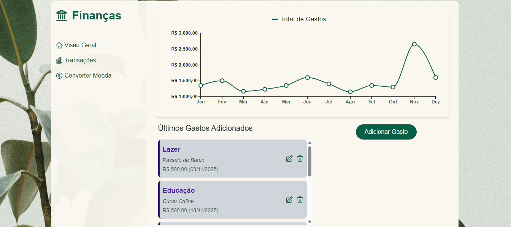

## 💰 Finanças com React

---
🔗 **Acesse online:**  
👉 [financas-com-react.vercel.app](https://financas-com-react.vercel.app/)

  
  

## 📖 Sobre o Projeto

**Finanças com React** é uma aplicação de controle financeiro pessoal desenvolvida com **React 19**, **Vite**, **Tailwind CSS** e **Material UI (MUI)**.

O sistema permite o **gerenciamento de transações mensais**, com **gráficos dinâmicos**, **filtros por mês**, **conversão de moeda em tempo real via API**, e uma **interface moderna e responsiva**.

> Este projeto foi criado para consolidar boas práticas de arquitetura front-end, componentização, gerenciamento de estado global e integração com APIs externas.

---

## 🚀 Principais Funcionalidades

- 📅 **Controle de transações mensais**  
  Visualização e filtragem de despesas por mês, com listagem e somatórios automáticos.

- 💵 **Conversão de moedas em tempo real**  
  A aplicação consome a API pública [AwesomeAPI](https://economia.awesomeapi.com.br/json/last/USD-BRL,ARS-BRL) para **atualizar automaticamente as taxas de câmbio** entre **BRL**, **USD** e **ARS** a cada 10 minutos.  
  A lógica é implementada no contexto `CurrencyProvider`, que faz:
  - Fetch das taxas de câmbio atuais.
  - Transformação dos dados crus da API.
  - Armazenamento das taxas no estado global.
  - Atualização automática com `setInterval`.

- 💹 **Gráficos interativos e responsivos**  
  Visualização das despesas com gráficos de pizza e linha usando `@mui/x-charts`.

- 🧭 **Rotas otimizadas com React Router v7**  
  Duas principais rotas:
  - `/` → Transações mensais
  - `/visaoGeral` → Dashboard geral

- 🧠 **Gerenciamento global de estado**  
  Implementado com **React Context API**, organizado em múltiplos providers:
  - `GastosProvider`
  - `ModalProvider`
  - `CurrencyProvider`
  - `DialogCurrencyProvider`

- ⚙️ **UI moderna e responsiva**  
  Desenvolvida com **TailwindCSS** e **MUI**, mantendo consistência visual entre desktop e mobile.

---

## 🧩 Estrutura de pastas
src/
├── componentes/
│   ├── BtAdd/                  # Botão de adicionar nova transação
│   ├── BtChangeCurrency/       # Botão para alterar moeda
│   ├── Contexts/               # Providers: Gastos, Modal, Currency, DialogCurrency
│   ├── DialogCurrency/         # Modal de seleção de moeda
│   ├── Grafico/                # Gráficos de linha
│   ├── ListaGastosFiltrados/   # Listagem de transações filtradas por mês
│   ├── MiniListaGastos/        # Lista resumida de gastos
│   ├── Modal/                  # Modal principal para adicionar gastos
│   ├── PieChart/               # Gráfico de pizza de distribuição de gastos
│   ├── SectionDefaultDesktop/  # Layout padrão desktop
│   ├── SelectedMonth/          # Seletor de mês
│   ├── TotalValueCard/         # Card com resumo de valores
│   └── Utils/                  # Funções auxiliares (filtros, formatações etc.)
│
├── Routes/
│   ├── Home/                   # Página de visão geral (gráficos + lista mini)
│   └── Transacoes/             # Página de transações detalhadas
│
├── App.jsx / main.jsx          # Ponto de entrada da aplicação
├── index.css                   # Estilos globais
└── vite.config.js              # Configuração do Vite

## ⚡ Tecnologias Utilizadas

| Categoria | Tecnologias |
|------------|--------------|
| **Frontend** | React 19, Vite 7 |
| **UI / Estilo** | TailwindCSS 4, MUI 7 |
| **Roteamento** | React Router 7 |
| **Gerenciamento de Estado** | Context API |
| **Gráficos** | @mui/x-charts |
| **APIs Externas** | [AwesomeAPI](https://economia.awesomeapi.com.br/json/last/USD-BRL,ARS-BRL) |
| **Utilitários** | dayjs, lucide-react |

---

## 🧠 Decisões Técnicas

Context API em vez de Redux: simplifica o gerenciamento global sem boilerplate.

Vite + Tailwind + MUI: combinação leve e moderna para produtividade e consistência visual.

Atualização periódica via setInterval: garante que o usuário tenha sempre as cotações atuais sem recarregar a página.

Hooks customizados e useMemo / useCallback: utilizados para otimizar cálculos e evitar re-renders desnecessários.

## 📚 Aprendizados Técnicos

Integração com APIs externas e tratamento de dados.

Uso avançado da Context API com múltiplos providers aninhados.

Estratégias de memoização para otimização de performance.

Combinação de MUI + TailwindCSS para interfaces coesas.

Estrutura de rotas escalável e responsiva com React Router.

---

## 🧩 Como Executar Localmente

 Clone o repositório
git clone https://github.com/rafaeltenorioo/financas-com-react.git

 Acesse a pasta do projeto
cd financas-com-react

 Instale as dependências
npm install

 Execute o projeto
npm run dev

Abra em: http://localhost:5173

## 💡 Ideias para evoluir a aplicação

📊 Mais tipos de gráficos (por categoria, semanal, etc.).

🌓 Suporte a tema claro/escuro.

🔍 Filtros avançados (categoria, faixa de valores).

🧪 Testes automatizados (Jest + React Testing Library).

## 👨‍💻 Como contribuir

Contribuições são muito bem-vindas!
Siga os passos abaixo:

 1. Faça um fork do projeto
 2. Crie uma nova branch
git checkout -b feature/nova-funcionalidade

 3. Faça as alterações e commit
git commit -m "Adiciona nova funcionalidade"

 4. Envie para o seu fork
git push origin feature/nova-funcionalidade

 5. Abra um Pull Request

## ✨ Autor

### Rafael Araujo Tenorio

📎 [LinkedIn](https://www.linkedin.com/in/rafael-ten%C3%B3rio-63792927b/)

## 🧾 Licença

Este projeto está sob a licença MIT — sinta-se à vontade para utilizar e modificar.
